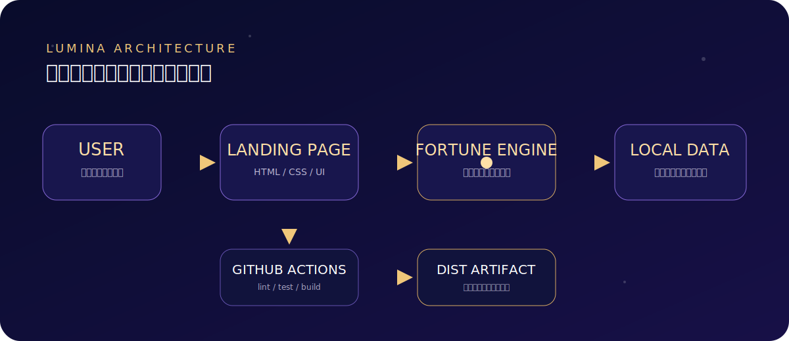
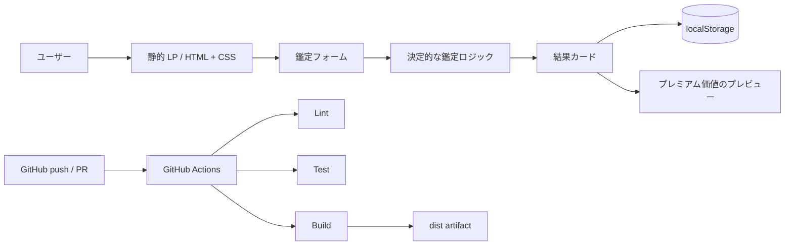

# LUMINA — 占いWebサービス LP プロトタイプ

深い紺紫と金色の光を基調にした、**実際に無料鑑定を操作できるランディングページ**です。未来を断定して不安を煽るのではなく、今日の小さな行動へ変換する「自己理解のためのオラクル体験」を設計しています。

> 2026-07-07 時点の OpenAI 公式ドキュメントで最新の GPT Image モデルとして案内されている **GPT Image 2** を使って最初のビジュアルコンセプトを生成し、その方向性を著作権上安全なオリジナル CSS / SVG と、CIで生成するPNGへ翻訳しました。




## できること

- 恋愛・仕事・金運・自分探しからテーマを選ぶ
- ニックネームと任意の生年月日を使った日替わり鑑定
- オラクルカード、解釈、今日の一歩、ラッキーカラーを表示
- 1日3回の無料デモ枠と連続利用日数を表示
- 結果をブラウザの `localStorage` に保存
- 有料詳細の価値と料金条件を先に示すプレミアムプレビュー
- キーボード操作、明確なフォーカス、`prefers-reduced-motion` 対応
- 依存パッケージなし、Node.js 標準機能だけで開発・テスト・ビルド

## 最短の起動方法

必要なものは Node.js 20 以上だけです。

```bash
npm install
npm run dev
```

ブラウザで **http://localhost:5173** を開きます。

| コマンド | 内容 |
| --- | --- |
| `npm run dev` | ローカル開発サーバーを起動 |
| `npm run lint` | JavaScript 構文と必須ファイルを検査 |
| `npm test -- --run` | 鑑定、回数、連続日数、保存をテスト |
| `npm run build` | `dist/` に静的サイトを生成 |
| `npm run preview` | ビルド済み `dist/` を確認 |

## アーキテクチャ



入力情報は外部へ送信されません。日付・テーマ・任意入力をハッシュ化して、用意した安全な文章セットから同じ日の同じ入力に同じ結果を返します。詳細は [docs/architecture.md](docs/architecture.md) を参照してください。

## 成功サービスから参考にした設計

調査では、LINE占いの「複数相談モードと初回無料価値」、ココナラの「選択肢・比較・匿名性」、cocoloniの「豊富な無料体験から低価格の特別鑑定」、Co–Starの「日替わりパーソナライズとフリーミアム」を共通パターンとして整理しました。ブランド、コピー、見た目はコピーせず、構造だけを参考にしています。

詳細と出典は [docs/market-research.md](docs/market-research.md) にあります。

## GPT Image 2 とデザイン

- 公式モデルページ: https://developers.openai.com/api/docs/models/gpt-image-2
- 公式画像生成ガイド: https://developers.openai.com/api/docs/guides/image-generation
- 生成コンセプト: 深い夜空、紫のオーロラ、金色の輪郭、光る水晶、静かで上質な日本語タイポグラフィ
- 実装資産: `public/hero-oracle.svg`、`styles.css`、`docs/assets/generated-readme-hero.png`

デザイン規則は [docs/design-system.md](docs/design-system.md) にまとめています。

## CI

`.github/workflows/ci.yml` は `push`、`pull_request`、手動実行に対応し、Node.js 22、`npm ci`、lint、test、build、`lumina-fortune-site` artifact 作成を行います。

## 本番化に必要なもの

現在は安全に試せるフロントエンドのみです。本番サービスでは最低限、次が必要です。

- 認証とアカウント削除を提供するバックエンド API
- PostgreSQL などのデータベースと暗号化・保持期間ポリシー
- 決済事業者連携、特定商取引法表示、更新・解約・返金導線
- 占い文章をレビュー・配信する CMS と専門家による監修
- 同意管理付き分析、プライバシーポリシー、利用規約
- 医療・法律・金融・自傷など高リスク相談の安全ガード
- エラー監視、バックアップ、レート制限、脆弱性管理

想定 Secrets 名だけを記載します（実値はコミットしません）。

- `DATABASE_URL`
- `AUTH_SECRET`
- `PAYMENT_SECRET_KEY`
- `PAYMENT_WEBHOOK_SECRET`
- `ANALYTICS_WRITE_KEY`

## 倫理方針

- カウントダウン、偽の残席、恐怖を使った課金誘導は実装しません。
- 結果は未来の断定ではなく、自己理解と行動の候補として提示します。
- 医療・法律・金融上の助言を代替しません。
- 無料枠、価格、更新条件、解約方法を購入前に明示する設計です。

## ドキュメント

- [初期設定](docs/setup.md)
- [アーキテクチャ](docs/architecture.md)
- [市場調査](docs/market-research.md)
- [デザインシステム](docs/design-system.md)
- [開発者ガイド](CODEX.md)

## License

MIT
