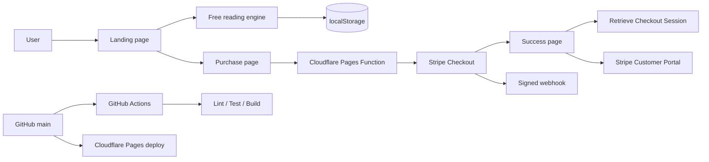

# LUMINA — 占いWebサービス / Stripe Checkout対応

LUMINAは、深い紺紫と金色の光を基調にした、実際に無料鑑定を操作できる占いWebサービスです。無料体験から詳細鑑定の購入までを一つの導線として設計し、恐怖・偽の緊急性・隠れた継続課金を使わないことを原則にしています。

> 最初の画面コンセプトは OpenAI **GPT Image 2** で作成し、その方向性をオリジナルのCSS・SVG・生成PNGへ翻訳しています。


## Production

- Site: https://lumina-fortune-landing.pages.dev
- Purchase: https://lumina-fortune-landing.pages.dev/purchase.html
- Hosting: Cloudflare Pages
- Production branch: `main`
- Build: `npm run build`
- Output: `dist`

## Features

### Free reading

- 恋愛・仕事・金運・自分探しの4テーマ
- ニックネームと任意の生年月日による日替わり鑑定
- オラクルカード、解釈、今日の一歩、ラッキーカラー、意識する言葉
- 1日3回の無料デモ枠
- 連続利用日数
- ブラウザ内 `localStorage` への履歴保存
- 結果コピー

### Stripe purchase flow

- 一回だけの詳細鑑定: **¥480 / 買い切り**
- LUMINA Plus: **¥980 / 月・自動更新**
- Stripe-hosted Checkout Session
- サーバー側で固定した価格とプランのみ購入可能
- 購入成功・キャンセル画面
- Checkout Session取得による購入結果確認
- Stripe Customer Portalによる月額契約管理・解約導線
- Webhook署名検証
- 特定商取引法に基づく表記、利用規約、プライバシーポリシー
- Stripeまたは販売者設定が不足している場合は購入ボタンを安全に無効化

## Quick start

Node.js 20以上が必要です。

```bash
npm install
npm run dev
```

ブラウザで `http://localhost:5173` を開きます。静的な購入画面も確認できますが、Cloudflare Pages Functionsを使う決済APIはCloudflare環境またはWrangler環境で動作します。

| Command | Purpose |
| --- | --- |
| `npm run dev` | ローカル静的サーバー |
| `npm run lint` | JavaScriptとFunctionsの構文検査 |
| `npm test -- --run` | 鑑定・保存・Checkout・Webhook署名テスト |
| `npm run build` | `dist/`へ静的サイトを生成 |
| `npm run preview` | ビルド済みサイトを確認 |

## Architecture



### Current frontend

- `index.html` — 無料鑑定LP
- `purchase.html` — プラン選択・購入準備
- `success.html` / `cancel.html` — Stripe復帰画面
- `commercial.html` / `terms.html` / `privacy.html` — 購入関連表示
- `src/fortune.js` — 決定的でテスト可能な鑑定ロジック
- `src/storage.js` — ブラウザ保存アダプター
- `src/checkout.js` — サーバー側プランカタログとCheckoutパラメータ
- `src/stripe-signature.js` — Webhook HMAC署名検証

### Cloudflare Pages Functions

- `/api/checkout-config`
- `/api/create-checkout-session`
- `/api/checkout-session`
- `/api/create-portal-session`
- `/api/stripe-webhook`

Stripe Checkout Sessionは購入のたびにサーバー側で新しく作成します。価格、通貨、買い切り・月額の区分はブラウザから受け取らず、`src/checkout.js`の許可済みカタログから生成します。

## Stripe production settings

実課金を有効化するには、Cloudflare PagesのVariables and Secretsに以下を設定します。実値はリポジトリへコミットしません。

- `STRIPE_SECRET_KEY`
- `STRIPE_WEBHOOK_SECRET`
- `PUBLIC_SITE_URL`
- `SELLER_NAME`
- `SELLER_ADDRESS`
- `SUPPORT_EMAIL`

詳細は [docs/stripe-setup.md](docs/stripe-setup.md) を参照してください。

## Security

- カード情報はStripe-hosted Checkoutが直接収集
- Checkout作成は同一オリジンのPOSTのみ
- 金額とプランはサーバー側で固定
- Session ID形式の検証
- Webhookの未加工本文、タイムスタンプ、HMAC SHA-256署名検証
- APIレスポンスは `Cache-Control: no-store`
- Secretや実ユーザーデータをGitへ保存しない

## Data and limitations

無料鑑定データはブラウザ内にだけ保存されます。現在のWebhookは署名済みイベントを検証・受領しますが、ユーザー認証やデータベースがないため、永続的な有料権限付与はまだ行いません。本番で有料コンテンツを恒久的に解放する場合は、認証、データベース、Webhookイベント台帳、権限テーブル、再送時の冪等性が必要です。

## Ethics

- 不安や恐怖を使って購入を迫りません。
- 偽のカウントダウン、残席、架空レビューを表示しません。
- 無料枠、価格、自動更新、解約条件を購入前に表示します。
- 占いは娯楽と自己理解を目的とし、医療・法律・金融の専門的助言を代替しません。

## Research and design

- [Market research](docs/market-research.md)
- [Design system](docs/design-system.md)
- [Architecture](docs/architecture.md)
- [Deployment](docs/deployment.md)
- [Stripe setup](docs/stripe-setup.md)
- [Local setup](docs/setup.md)
- [Contributor guide](CODEX.md)

OpenAI references:

- https://developers.openai.com/api/docs/models/gpt-image-2
- https://developers.openai.com/api/docs/guides/image-generation

Stripe references:

- https://docs.stripe.com/api/checkout/sessions/create
- https://docs.stripe.com/checkout/quickstart
- https://docs.stripe.com/webhooks

## CI

GitHub Actions runs on push, pull request and manual dispatch. It installs dependencies, checks JavaScript and Cloudflare Functions, runs Node tests, builds all static pages and uploads the `lumina-fortune-site` artifact.

## License

MIT
