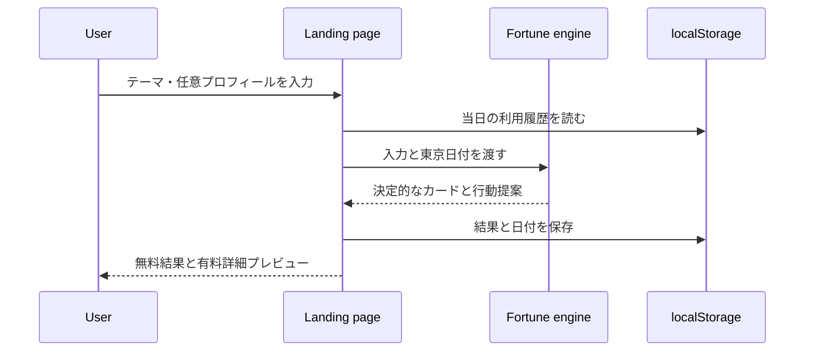
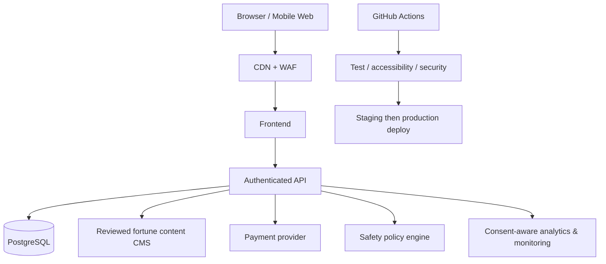

# Architecture

## 現在の構成

LUMINA は、バックエンドを持たない静的プロトタイプです。ユーザー入力、鑑定生成、履歴保存はすべてブラウザ内で完結します。

### コンポーネント

- `index.html`: セマンティックなページ構造、フォーム、結果、料金、FAQ
- `styles.css`: レスポンシブ表示、モーション、フォーカス、色とレイアウト
- `src/fortune.js`: 純粋な鑑定・回数・連続日数ロジック
- `src/storage.js`: localStorage を隔離した保存アダプター
- `src/app.js`: DOM イベントと表示更新
- `server.mjs`: localhost 用の依存ゼロ静的サーバー
- `scripts/build.mjs`: 配布用 `dist/` を生成
- `test/`: Node.js 標準テスト

## データフローとプライバシー

入力はネットワーク送信しません。`localStorage` に最大30件の結果を保存します。開発用リセットボタン、またはブラウザのサイトデータ削除で消去できます。生年月日を含むため、本番化時には明示的同意、最小収集、削除、暗号化、保持期間が必要です。

## CI/CD

GitHub Actions は checkout、Node setup、`npm ci`、lint、test、build、artifact upload を行います。README画像生成workflowはSVGをPNGへ変換し、READMEを公開します。現時点ではデプロイは自動化せず、`dist` artifact を配布可能な成果物とします。

## 本番ターゲット

### 本番で追加する責務

- Frontend: 同意、認証、購入前説明、履歴、解約・削除
- Backend: 入力検証、レート制限、権限、監査、コンテンツ配信
- Database: 暗号化、バックアップ、地域、保持・削除ジョブ
- Billing: Webhook 署名検証、二重課金防止、返金と解約
- CMS: 専門家レビュー、禁止表現、版管理、公開承認
- Safety: 高リスク相談の検知、専門窓口への案内、決定論的表現の禁止
- Analytics: 同意前は非稼働、個人情報を送らないイベント設計

## Secrets

実値はリポジトリに置きません。候補名は `DATABASE_URL`、`AUTH_SECRET`、`PAYMENT_SECRET_KEY`、`PAYMENT_WEBHOOK_SECRET`、`ANALYTICS_WRITE_KEY` です。

## 今後の拡張

1. 読み返し価値の高い日記・振り返り
2. 友人との相性共有は明示同意と削除を前提に追加
3. 人間の鑑定士への接続は資格・品質・通報・返金制度を整備
4. 多言語、PWA、通知は頻度をユーザーが完全に制御
5. A/B テストは課金圧力ではなく理解度・満足度・安全性を評価
